# Receipt Scanner PWA 🧾

A mobile-first Progressive Web App for scanning, organizing, and tracking business expense receipts with AI-powered data extraction.

**Live App**: https://receipt-scanner-rho.vercel.app

## Features

- 📸 **Scan Receipts** - Camera capture or file upload
- 🤖 **AI Extraction** - Claude Haiku extracts merchant, date, amount, category
- 💬 **AI Assistant** - Chatbot to answer questions like "How much did I spend on food?"
- ✏️ **Manual Entry** - Add cash expenses or edit scanned receipts
- 🔄 **Duplicate Detection** - Transaction ID, image hash, and smart matching
- ☁️ **Cloud Storage** - Images stored in Supabase Storage (IRS audit-ready)
- 📊 **Dashboard** - MTD/YTD tracking with category breakdown
- 📥 **CSV Export** - Download for accountant
- 📱 **PWA** - Install on phone, works offline

---

## Solution Architecture

```mermaid
flowchart TB
    subgraph Client["📱 Client (Browser/PWA)"]
        UI[React UI]
        Camera[Camera Capture]
    end

    subgraph Vercel["☁️ Vercel (Serverless)"]
        NextJS[Next.js 16 App Router]
        API[API Routes]
    end

    subgraph Supabase["🗄️ Supabase (Cloud)"]
        DB[(PostgreSQL Database)]
        Storage[Object Storage]
    end

    subgraph Anthropic["🤖 Anthropic"]
        Claude[Claude 3 Haiku Vision]
    end

    UI --> Camera
    Camera -->|Upload Image| API
    API -->|Extract Data| Claude
    Claude -->|JSON Response| API
    API -->|Save Metadata| DB
    API -->|Upload Image| Storage
    API -->|Return Result| UI
    UI -->|Fetch Receipts| API
    API -->|Query| DB
```



---

## Data Flow Diagram

```mermaid
sequenceDiagram
    participant User as 📱 User
    participant App as 🌐 Next.js App
    participant Claude as 🤖 Claude AI
    participant DB as 🗄️ Supabase DB
    participant Storage as 📦 Supabase Storage

    User->>App: 1. Upload receipt image
    App->>App: 2. Generate image hash (MD5)
    App->>DB: 3. Check for duplicate (hash/transactionId)
    
    alt Duplicate Found
        DB-->>App: Existing receipt
        App-->>User: ⚠️ Duplicate detected!
    else New Receipt
        App->>Claude: 4. Send image for extraction
        Claude-->>App: 5. JSON {merchant, date, amount, category}
        App->>DB: 6. Check smart duplicate (merchant+date+amount)
        
        alt Smart Duplicate
            DB-->>App: Existing receipt
            App-->>User: ⚠️ Duplicate detected!
        else New Receipt
            App->>Storage: 7. Upload image to cloud
            Storage-->>App: Public URL
            App->>DB: 8. Save receipt record
            DB-->>App: Receipt saved
            App-->>User: ✅ Receipt scanned!
        end
    end
```



---

## Tech Stack

| Layer | Technology | Purpose |
|-------|------------|---------|
| **Frontend** | Next.js 16, React 19 | UI & routing |
| **Styling** | Tailwind CSS 4 | Modern styling |
| **Backend** | Next.js API Routes | Serverless functions |
| **Database** | PostgreSQL (Supabase) | Receipt metadata |
| **Storage** | Supabase Storage | Receipt images |
| **AI** | Claude 3 Haiku | Receipt data extraction |
| **Hosting** | Vercel | Serverless deployment |
| **ORM** | Prisma | Database access |

---

## Environment Variables

```env
# Anthropic AI
ANTHROPIC_API_KEY=sk-ant-...

# Supabase Database
DATABASE_URL=postgresql://postgres...
DIRECT_URL=postgresql://postgres...

# Supabase Storage
NEXT_PUBLIC_SUPABASE_URL=https://xxx.supabase.co
NEXT_PUBLIC_SUPABASE_ANON_KEY=eyJ...
```

---

## Local Development

```bash
# Install dependencies
npm install

# Setup database
npx prisma db push

# Run dev server
npm run dev
```

---

## Deployment

1. Push to GitHub
2. Connect to Vercel
3. Add environment variables
4. Deploy!

---

## Cost Breakdown

| Service | Cost |
|---------|------|
| Vercel | FREE (hobby tier) |
| Supabase Database | FREE (500MB) |
| Supabase Storage | FREE (1GB) |
| Anthropic Claude | ~$0.25/1000 receipts |

---

## License

MIT
